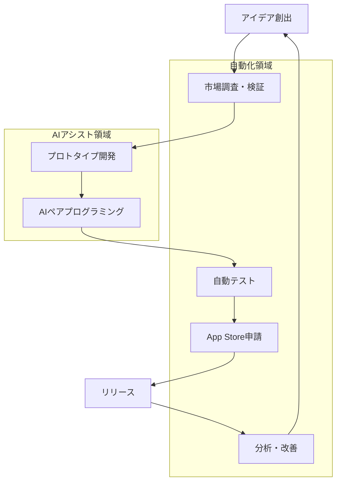

# 🚀 AIUELAB プロジェクトスケッチ

## 📋 事業概要

**事業名**: AIUELAB  
**代表**: 郡司 崇  
**ミッション**: AIと自動化を活用した個人開発によるコンスタントなiOSアプリリリース

## 🎯 ビジョンと目標

### 短期目標（2025年）
- **月次リリース**: iOSアプリを毎月1本以上リリース
- **自動化率**: 業務プロセスの80%以上を自動化
- **国内市場**: 日本市場でのプレゼンス確立

### 中期目標（2026-2027年）
- **グローバル展開**: 英語圏への進出
- **プラットフォーム拡大**: Android版の同時リリース
- **収益化**: サブスクリプションモデルの確立

### 長期目標（2028年〜）
- **マルチプラットフォーム**: Web アプリ・サービスの展開
- **完全自動化**: 人間の介入を最小限にした運営

## 🔄 業務フロー



## 🛠 技術スタック

### 開発環境
- **IDE**: Cursor / Claude Code
- **AI アシスタント**: Claude 3.5 Sonnet / GPT-4
- **ペアプログラミング**: ライブコーディング with AI

### iOS開発
- **言語**: Swift / SwiftUI
- **フレームワーク**: Combine, Core Data
- **CI/CD**: Xcode Cloud / Fastlane
- **配信**: App Store Connect API

### 自動化インフラ
- **ワークフロー**: n8n
- **タスク実行**: Raycast Extension
- **モニタリング**: Custom Scripts
- **MCP サーバー**: 完全統合済み

## 📊 開発プロセス

### 1. アイデアフェーズ
```yaml
入力:
  - 市場トレンド分析（自動）
  - ユーザーフィードバック
  - AIによる提案

処理:
  - n8n: トレンド収集ワークフロー
  - AI: アイデア評価・スコアリング

出力:
  - 開発候補リスト
  - 優先順位付け
```

### 2. 開発フェーズ
```yaml
入力:
  - 要件定義
  - デザインモックアップ

処理:
  - Cursor: AIペアプログラミング
  - Claude Code: コード生成・レビュー
  - MCP: 外部サービス連携

出力:
  - 完成したアプリケーション
  - テストレポート
```

### 3. リリースフェーズ
```yaml
入力:
  - ビルド済みアプリ
  - メタデータ

処理:
  - Fastlane: 自動申請
  - n8n: ステータス監視
  - Raycast: ワンクリック操作

出力:
  - App Store公開
  - リリースノート
```

## 🤖 自動化マップ

### 完全自動化済み
- ✅ コード品質チェック（Ruff, MyPy）
- ✅ テスト実行（pytest）
- ✅ ドキュメント生成（MkDocs）
- ✅ 市場トレンド収集（n8n）
- ✅ ビルド・デプロイ（CI/CD）

### AI アシスト必要
- 🤝 アーキテクチャ設計
- 🤝 UI/UX デザイン
- 🤝 複雑なビジネスロジック
- 🤝 App Store 説明文作成

### 人間の判断必要
- 👤 最終的な品質確認
- 👤 価格戦略決定
- 👤 マーケティング方針
- 👤 法的・倫理的判断

## 💰 マネタイズ戦略

### フェーズ 1: 基盤構築
- **無料アプリ**: ユーザーベース構築
- **広告収入**: AdMob 統合
- **データ収集**: ユーザー行動分析

### フェーズ 2: 収益化
- **フリーミアム**: 基本無料 + プレミアム機能
- **サブスクリプション**: 月額/年額プラン
- **アプリ内購入**: 追加コンテンツ

### フェーズ 3: 拡大
- **B2B展開**: 企業向けソリューション
- **API提供**: 開発者向けサービス
- **ホワイトラベル**: OEM提供

## 📈 KPI と目標値

### 月次目標
| 指標 | 目標値 | 測定方法 |
|------|--------|----------|
| リリース数 | 1本以上 | App Store Connect |
| DAU | 10,000+ | Firebase Analytics |
| 収益 | ¥500,000+ | App Store Connect |
| 自動化率 | 80%+ | タスク分析 |
| AIコード貢献度 | 60%+ | Git統計 |

### 年次目標
| 年度 | アプリ数 | 総ユーザー | 年間収益 |
|------|----------|------------|----------|
| 2025 | 12 | 100,000 | ¥6M |
| 2026 | 24 | 500,000 | ¥30M |
| 2027 | 36 | 2,000,000 | ¥120M |

## 🚀 実行計画

### 即時実行（今週）
1. 開発環境の最終調整
2. 第1号アプリの要件定義
3. 自動化ワークフローのテスト

### 短期実行（今月）
1. プロトタイプ完成
2. App Store Developer Program 登録
3. CI/CD パイプライン構築

### 中期実行（3ヶ月）
1. 3本のアプリリリース
2. ユーザーフィードバック収集システム構築
3. 収益化モデルのA/Bテスト

## 🔧 技術的実装状況

### ✅ 完了済み
- MCP サーバー統合（Serena, GitHub, Firecrawl等）
- n8n ワークフロー基盤
- Raycast Extension 開発
- 開発環境自動化スクリプト

### 🚧 実装中
- iOS アプリテンプレート作成
- Fastlane 設定
- App Store Connect API 統合

### 📋 計画中
- Android 開発環境
- Web アプリフレームワーク選定
- グローバル展開用多言語対応

## 📝 成功要因

### 強み
- **AI活用**: 最新のAI技術を活用した高速開発
- **自動化**: 徹底した業務自動化による効率化
- **柔軟性**: 個人開発による迅速な意思決定

### 課題と対策
| 課題 | 対策 |
|------|------|
| リソース制限 | AI・自動化による補完 |
| 品質管理 | 自動テスト・AIレビュー |
| マーケティング | n8n による自動配信 |
| スケール | クラウドインフラ活用 |

## 🎯 最終ゴール

**「人間が創造的な判断のみに集中し、実装・運用・保守のすべてをAIと自動化で完結させる、次世代の個人開発モデルの確立」**

---

*このドキュメントは生きたドキュメントとして、プロジェクトの進行に応じて継続的に更新されます。*

*最終更新: 2025年8月20日*
